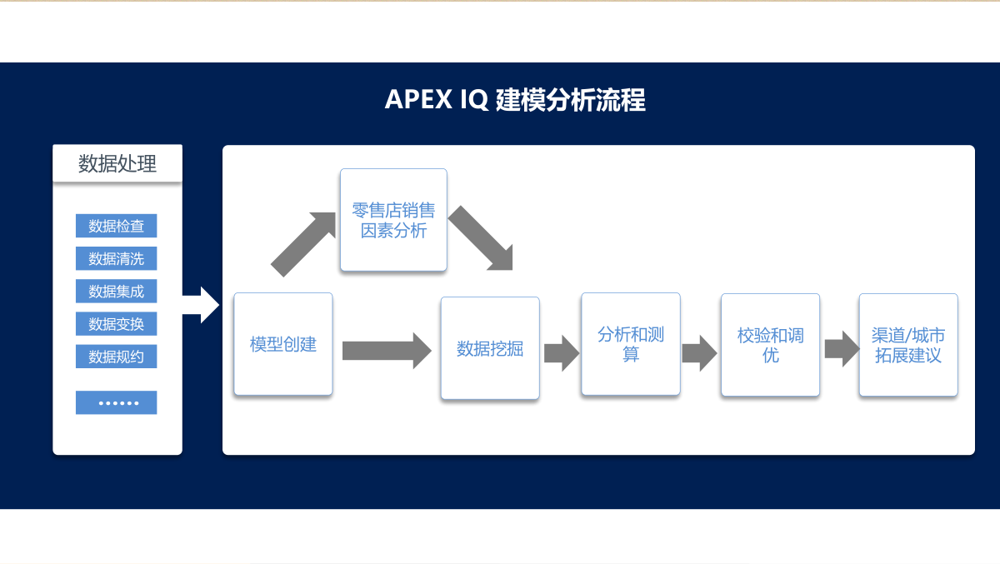
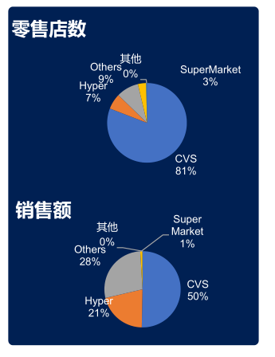
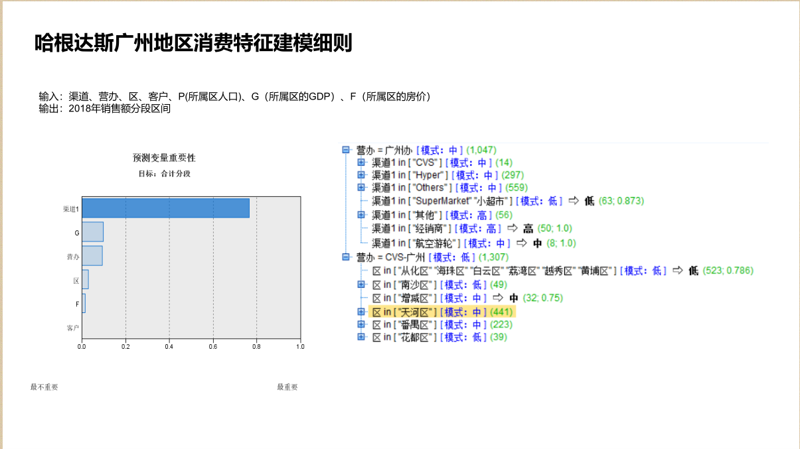

## Algorithms or solutions
1. k-means聚类算法
2. 决策树模型
## Azure Service
1. Azure Machine Learning Studio
2. Azure SQL DB & MySQL
## Architecture
The following is the Architecture wo use in this hacking

## Result
There are some results

[Our Model](http://apex-nexus2.chinapex.com.cn/#/ai/cal/model)