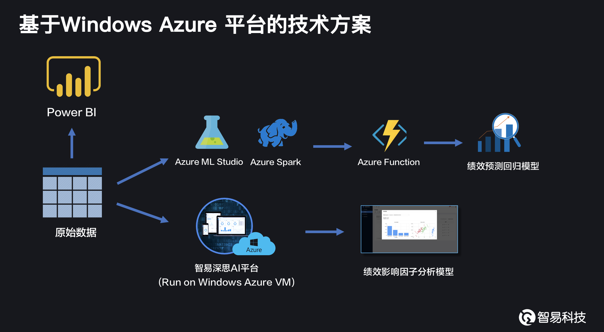
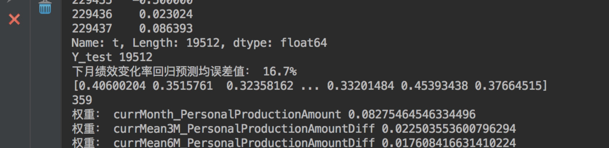
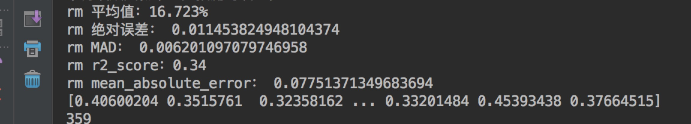

## Algorithms or solutions
Please list all the algorithms or solutions you used for this problem.
随机森林，神经网络，特征工程，特征权重计算

## Azure Service
Please list all the Services you used during the process of solving problem.
Azure Cloud VM, Azure ML Studio, PowerBI, Azure Spark, Azure function.

## Architecture
Please provide an architecture image if possible.

## Result
Any Results or Web Service API. Some Results or Dashboard images are required.

