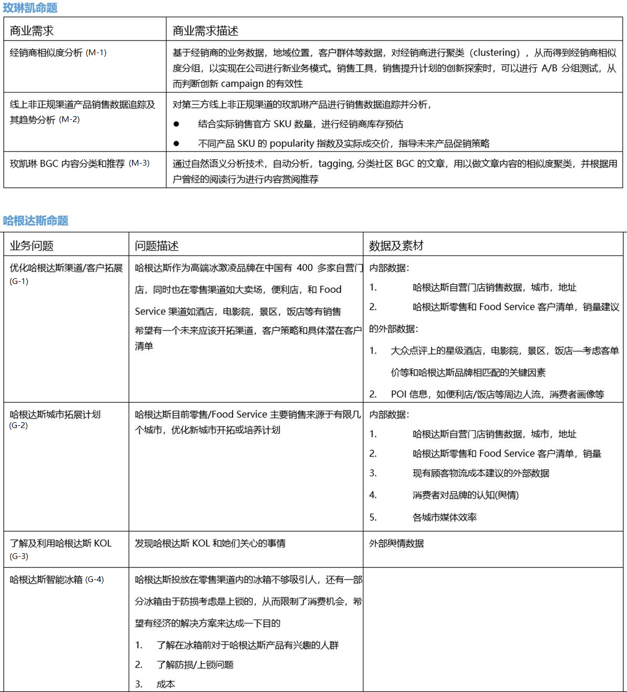

## IndustryHack @ June 2018
This Directory is for MS Industry Hack @ June 2018 Reference and result submission. Before you upload your final results, please finish the [survey](https://forms.office.com/Pages/ResponsePage.aspx?id=v4j5cvGGr0GRqy180BHbR5csyDIzYMtMot5Hbyct1YNUM0o1SlVYRlQ1MkRFMVFKOVBTRENJRUE4MS4u) to help us know more about you.

## Topics
In this hack, we have two customers, MaryKay & GeneralMills, and 7 topics in total. All the topics can be seen in this image.

## How to submit your result
1. Based on the problem code ( e.g. `MaryKay M-1` ), create new sub-directory named by your company name under the proper directory (e.g. `Hack@June/MaryKay/M-1/{Company Name}` ).
2. Create a README.md file in the created directory and put all the related results into the created directory.
3. Provide more detail info in the README.md, following the `README_template.md` template.

