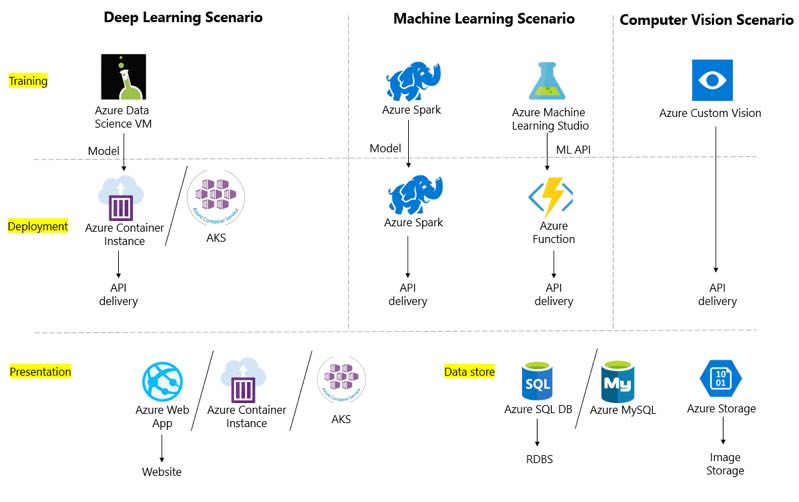

## IndustryHack
This Repo is for MS Industry Hack Reference and result submission. Before you upload your results for Hack, please go into the right directory and follow the `README.md` in the directory.

## Azure AI Platform Reference
Below is the full lifecycle in data science and you can find many services on Azure to help you go through the full lifecycle.

* Azure Custom Vision Service [Ref](http://aka.ms/customvision)
* Azure Machine Learning Studio [Ref](http://aka.ms/amlstudio)
* Azure Machine Leanring Service [Ref](http://aka.ms/amlservice)
* Azure Deep Learning VM (DLVM) and GPU [Ref](http://aka.ms/azuregpu)
* Azure Machine Learning Package for Text Analytics [Ref](http://aka.ms/tatk)
* Azure Machine Learning Package for Computer Vision [Ref](http://aka.ms/cvtk)
* Azure Machine Learning Package for Forecasting [Ref](http://aka.ms/ftk)

## Azure Computing and Data Platform Reference
You can also leverage Azure computing and data services to deploy your solution.

* Azure App Servie [Ref](https://docs.microsoft.com/en-us/azure/app-service/)
* Azure SQL DB [Ref](https://docs.microsoft.com/en-us/azure/sql-database/)
* Azure MySQL DB [Ref](https://docs.microsoft.com/en-us/azure/mysql/)
* Azure Storage [Ref](https://docs.microsoft.com/zh-cn/azure/storage/)
* Azure Cosmos DB [Ref](https://docs.microsoft.com/zh-cn/azure/cosmos-db/)
* Azure HDInsight [Ref](https://docs.microsoft.com/en-us/azure/hdinsight/)
* Azure Container Service [Ref](https://docs.microsoft.com/en-us/azure/aks/)

## Azure IoT Service
You can also involve Azure IoT service into your solution.

* Azure IoT Edge [Ref](https://azure.microsoft.com/en-us/services/iot-edge/)

## Azure Architecture
We suggest you can solve the partner's requirements using Azure AI Platform, which shows in below architecture.

## Doc Structure
* Hack@May: Docs and Results, generated in May Industry Hack
* Hack@June: Docs and Results, generated in June Industry Hack
* img: Architecture images

